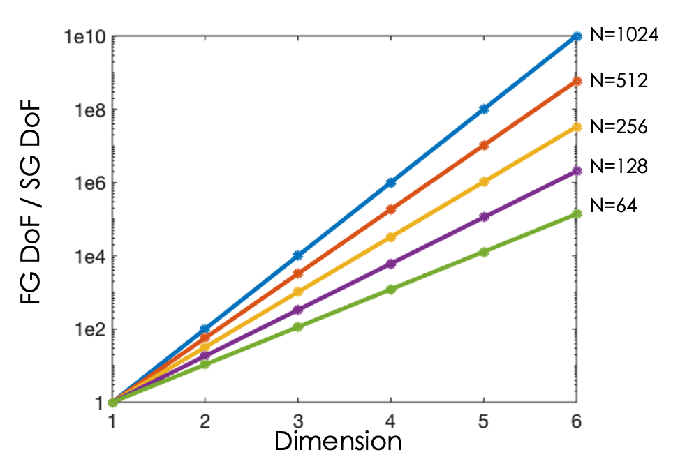

# Summary

Many areas of science exhibit physical [^1] processes which are described by high dimensional partial differential equations (PDEs), e.g., the 4D [@dorf2013], 5D [@candy2009] and 6D models [@juno2018] describing magnetized fusion plasmas, models describing quantum chemistry, or derivatives pricing [@bandrauk2007]. In such problems, the so called "curse of dimensionality" whereby the number of degrees of freedom (or unknowns) required to be solved for scales as $N^D$ where $N$ is the number of grid points in any given dimension $D$. A simple, albeit naive, 6D example is demonstrated in the left panel of Figure \ref{fig:scaling}. With $N=1000$ grid points in each dimension, the memory required just to store the solution vector, not to mention forming the matrix required to advance such a system in time, would exceed an exabyte - and also the available memory on the largest of supercomputers available today. The right panel of Figure \ref{fig:scaling} demonstrates potential savings for a range of problem dimensionalities and grid resolution. While there are methods to simulate such high-dimensional systems, they are mostly based on Monte-Carlo methods [@e2020] which rely on a statistical sampling such that the resulting solutions include noise. Since the noise in such methods can only be reduced at a rate proportional to $\sqrt{N_p}$ where $N_p$ is the number of Monte-Carlo samples, there is a need for continuum, or grid / mesh based methods for high-dimensional problems which both do not suffer from noise and bypass the curse of dimensionality. Here we present a simulation framework which provides such a method using adaptive sparse grids [@pfluger2010].

[^1]:This manuscript has been authored by UT-Battelle, LLC, under contract DE-AC05-00OR22725 with the US Department of Energy (DOE). The publisher acknowledges the US government license to provide public access under the DOE Public Access Plan (https://energy.gov/downloads/doe-public-access-plan).

The Adaptive Sparse Grid Discretization (ASGarD) code is a framework specifically targeted at solving high-dimensional PDEs using a combination of a Discontinuous-Galerkin Finite Element solver implemented atop an adaptive sparse grid basis. The adaptivity aspect allows for the sparsity of the basis to be adapted to the properties of the problem of interest, which facilitates retaining the advantages of sparse grids in cases where the standard sparse grid selection rule is not the best match. A prototype of the non-adaptive sparse-grid implementation was used to produce the results of [@dazevedo2020] for 3D time-domain Maxwell's equations. The implementation utilizes both CPU and GPU resources, as well as being single and multi-node capable. Performance portability is achieved by casting the computational kernels as linear algebra operations and relying on vendor provided BLAS libraries. Several test problems are provided, including advection up to 6D with either explicit or implicit timestepping.

![Illustration of the curse of dimensionality in the context of solving a 6 dimensional PDE (e.g., those at the heart of magnetically confined fusion plasma physics) on modern supercomputers, and how the memory required to store the solution vector (solid black curves) and the matrix (magenta curves) in both naive and Sparse Grid based discretizations as the resolution of the simulation domain is varied. Memory limits of the Titan and Summit supercomputers at Oak Ridge National Laboratory, in addition to an approximate value for an ExaScale supercomputer, are overlaid for context](figures/sparse-vs-full.png)

 

# Statement of Need

The goal of ASGarD is to facilitate and promote the use of adaptive sparse-grid methods by domain scientists for the approximation of kinetic models by providing a robust yet flexible adaptive sparse-grid library.

# Acknowledgements

This research used resources of the Oak Ridge Leadership Computing Facility (OLCF) at the Oak Ridge National Laboratory, and the National Energy Research Scientific Computing Center (NERSC), which are supported by the Office of Science of the U.S. Department of Energy under Contract Numbers DE-AC05-00OR22725 and DE-AC02-05CH11231 respectively.

# References
